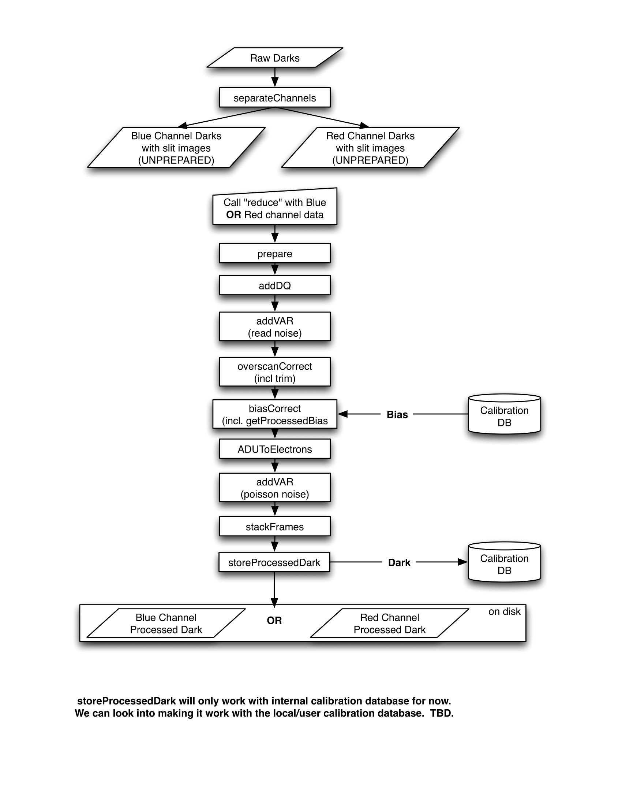

.. recipes:

.. _GHOST_Recipes_and_Flows:

*****************
Recipes for GHOST
*****************

Typical Processing Flows
========================

Here we review some of the typical processing workflows for GHOST data
reduction. For this discussion, it is assumed you've already installed the
latest Ureka package and made a local clone of the ``ghostdr`` Hg repository.
(For illustrative purposes, the text below assumes the clone's working copy
root is ``wc/``.)

Furthermore, for the commands given below to work properly, you must:

 #. initialize the Ureka environment: ``ur_setup``
 #. create a symlink named ``wc/externals/gemini_python/astrodata_GHOST``
    pointing to ``wc/astrodata_GHOST``,
 #. add ``wc/externals/gemini_python`` to the beginning of your ``PYTHONPATH``,
    and
 #. add ``wc/externals/gemini_python/astrodata/scripts`` and
    ``wc/externals/gemini_python/recipe_system/apps`` to the beginning of your
    ``PATH``

Generating a Bias Calibration frame
-----------------------------------

To generate a bias calibration frame you need 2 or more GHOST bias frames from
the same arm.  Until the instrument is live, you can use the GHOST simulator to
generate this data.  Its ``testsim.py`` script will create several types of
frames, so run it a few times to create a couple of bias frames. You may want
to comment out the other frames types for speed, and rename the biases between
runs so they're not overwritten.

Once you have a few biases of the same arm to work with, generate a file list
using the ``typewalk`` utility.  The following command assumes you have generated
several red arm biases (if you don't specify either ``GHOST_RED`` or
``GHOST_BLUE``, you may get mixed red and blue frames which don't stack well!)::

    typewalk --types GHOST_BIAS GHOST_RED --dir <path_to>/data_folder -o bias.list

Now you are ready to generate a bias calibration frame.  The following command
(which runs the ``makeProcessedBiasG`` Gemini recipe behind the scenes) will
stack the bias frames in listed ``bias.list`` and store the finished bias
calibration in ``calibrations/storedcals/``::

    reduce @<path_to>/bias.list

This code call will place a file named ``bias_red_bias.fits`` in the
``calibrations/storedcals`` directory of your present working directory.

The whole process behind Gemini's ``makeProcessedBias`` recipe is documented in
the following flowchart (thanks Kathleen Labrie):

.. image:: images/biasCalibration.png
  :scale: 30

Generating a Dark Calibration Frame
-----------------------------------

The procedure for generating a dark calibration frame is broadly similar to
making a bias calibration frame. However, the type to be passed to ``typewalk``
should be ``GHOST_DARK`` instead of ``GHOST_BIAS`` (in addition to the necessary
``GHOST_RED``/``GHOST_BLUE`` type).

Assuming ``typewalk`` has output your list of dark frames to ``dark.list``,
attempting to run::

    reduce @<path_to>/dark.list

will fail. This is because the framework cannot currently find calibrations
stored on disk (it uses a much more complicated lookup scheme).  The workaround
for the time being is to force it to look on disk in a particular area using the
``--override_cal`` option::

    reduce @<path_to>/dark.list  --override_cal processed_bias:calibrations/storedcals/bias_red_bias.fits

This call will place a file ``dark_red_dark.fits`` into the
``calibrations/storedcals`` directory.

The whole process behind Gemini's ``makeProcessedDark`` recipe is documented in
the following flowchart (thanks Kathleen Labrie):

Reducing an Object frame (Spectra)
----------------------------------

The GHOST simulator produces object spectra frames like ``obj100_red.fits``
(the actual names will also include a bunch of additional information, like
resolution mode and exposure time). If
you run ``typewalk`` on the folder containing these, you'll see that they are
identified as ``GHOST_SPECT``::

    typewalk --dir <path_to>/data_folder

This informs the reduction framework to run the ``reduceG`` GHOST recipe on
them, which should run to at least the ``darkCorrection`` step now that you
have dark and bias calibration frames (for the moment, we have commented the
remaining steps out of the ``reduceG`` recipe so it will complete
successfully::

    reduce <path_to>/data_folder/obj100_red.fits

The above command will fail due to the faulty calibrations lookup. Again, we
need to use the ``--override_cal`` option::

    reduce <path_to>/data_folder/obj100_red.fits --override_cal processed_bias:calibrations/storedcals/bias_red_bias.fits processed_dark:calibrations/storedcals/dark_red_dark.fits

This produces a ``obj100_red_darkCorrected.fits`` file, a bias and dark
corrected GHOST spectra.

Other Processing Flows
======================
include scientific flow charts, include associated recipes

