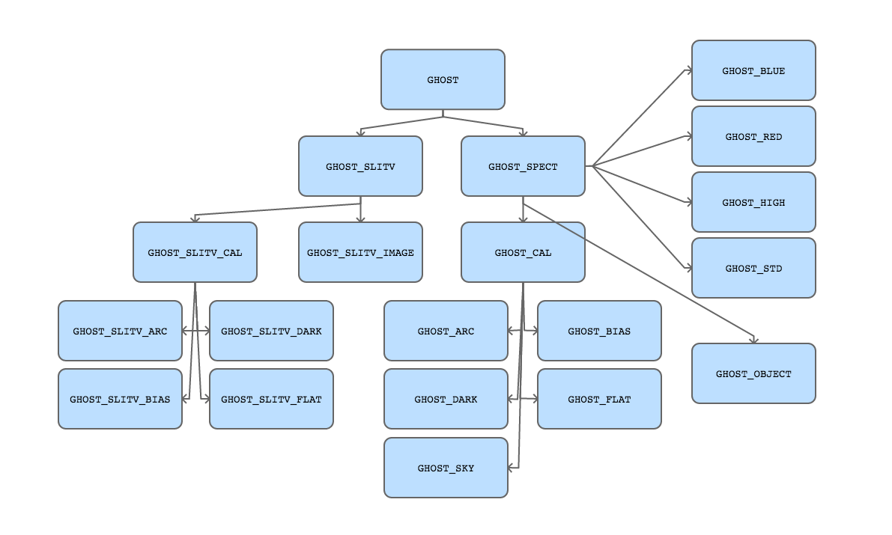

.. ADtypes:

***************
AstroData Types
***************

Relevant AstroData Types
========================

    Inheritance tree of AstroData types for GHOST

Association Tables
==================

Top-level
---------

+------------------------------+-----------------------------------------------+
| **AstroData Type**           | **Observation Type**                          |
+------------------------------+-----------------------------------------------+
| ``GHOST``                    | Applies to all data taken using the           |
|                              | GHOST instrument                              |
+------------------------------+-----------------------------------------------+

Parent types
------------

+------------------------------+-----------------------------------------------+
| **AstroData Type**           | **Observation Type**                          |
+------------------------------+-----------------------------------------------+
| ``GHOST_SPECT``              | Any form of data taken with the main          |
|                              | GHOST spectrograph                            |
+------------------------------+-----------------------------------------------+
| ``GHOST_SLITV``              | Any form of data taken using the GHOST        |
|                              | slit-viewing camera                           |
+------------------------------+-----------------------------------------------+

Child types of ``GHOST_SPECT``
------------------------------

Instrument configuration types
++++++++++++++++++++++++++++++

+------------------------------+-----------------------------------------------+
| **AstroData Type**           | **Observation Type**                          |
+------------------------------+-----------------------------------------------+
| ``GHOST_BLUE``               | Any data taken on the blue arm of the main    |
|                              | spectrograph                                  |
+------------------------------+-----------------------------------------------+
| ``GHOST_RED` `               | Any data taken on the red arm of the main     |
|                              | spectrograph                                  |
+------------------------------+-----------------------------------------------+
| ``GHOST_STD``                | Any data taken with the spectrograph in       |
|                              | standard resolution mode                      |
+------------------------------+-----------------------------------------------+
| ``GHOST_HIGH``               | Any data taken with the spectrograph in       |
|                              | high resolution mode                          |
+------------------------------+-----------------------------------------------+

Data source types
+++++++++++++++++

+------------------------------+-----------------------------------------------+
| **AstroData Type**           | **Observation Type**                          |
+------------------------------+-----------------------------------------------+
| ``GHOST_ARC``                | Any form of data taken with the main          |
|                              | GHOST spectrograph                            |
+------------------------------+-----------------------------------------------+
| ``GHOST_BIAS``               | Any form of data taken using the GHOST        |
|                              | slit-viewing camera                           |
+------------------------------+-----------------------------------------------+
| ``GHOST_DARK``               | Any form of data taken using the GHOST        |
|                              | slit-viewing camera                           |
+------------------------------+-----------------------------------------------+

Child types of ``GHOST_SLITV``
------------------------------
