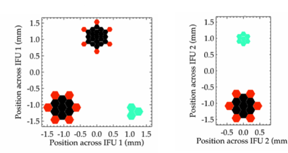

.. instrument:

.. _GHOST_Instrument_Overview:

*****************
Overview of GHOST
*****************

Description of the Instrument
=============================

GHOST is a high resolution visible light fibre-fed echelle spectrograph.
It has a wide variety of observing modes tuned to a range of science cases.

GHOST has two positioners, known as “IFU1” and “IFU2”. The layout of each
focal plane is shown below. Each comprises multiple micro-lens arrays
(black hexagons) feeding fiber bundles for targeting science fields at standard
(large hexagons in IFU1 and 2) or high (small hexagons in IFU1) spectral
resolution, peripheral guide fibers surrounding the science fields
(red hexagons), and dedicated sky fibers at a fixed offset position a few
arcseconds from the science fields (cyan hexagons).
Each positioner can access different halves of the 7.5 arcminute field
(as shown in Figure 4), with a 16” common region of overlap.

The instrument has two distinct observing modes. In 'standard' mode, up to two
targets can be observed simultaneously using the large fibre bundles on IFU1
and IFU2. In 'high resolution' mode, a single target can be observed using the
high-resolution bundle on IFU1. A ThXe calibration lamp can also be supplied
simultaneously with the observations, for precision radial velocity observations.
Sky fibre bundles are provided for 'standard' mode on IFU1, and for
'high-resolution' mode on IFU2.

+----------------------+-----------------------------------------+-------------------------+
| **Mode**             |          **Standard Resolution**        |    **High Resolution**  |
+======================+=========================================+=========================+
| **Spectral coverage**| 363-950nm, simultaneous                 | 363-950nm, simultaneous |
+----------------------+-----------------------------------------+-------------------------+
| **Spectral           | 50,000                                  | 75,000                  |
| resolution**         |                                         |                         |
+----------------------+-----------------------------------------+-------------------------+
| **Radial velocity    | 300 m/s                                 | 30 m/s                  |
| precision**          |                                         |                         |
+----------------------+-----------------------------------------+-------------------------+
| **Multiplexing**     | Dual targets                            | Single target           |
|                      | (82" minimum separation)                |                         |
+----------------------+-----------------------------------------+-------------------------+
| **Patrol field**     | 7.5' semicircle                         | 7.5'                    |
|                      | (16" overlap between IFUs)              |                         |
+----------------------+-----------------------------------------+-------------------------+
| **IFU plane size**   | 1.2"                                    | 1.2"                    |
+----------------------+-----------------------------------------+-------------------------+
| **IFU element        | 7 :math:`\times` 0.4"                   | 19 :math:`\times` 0.2"  |
| number and size**    |                                         |                         |
+----------------------+-----------------------------------------+-------------------------+
| **Sky fibres**       | 3 :math:`\times` 0.4"                   | 7 :math:`\times` 0.2"   |
|                      | (on IFU 1)                              | (on IFU 2)              |
+----------------------+-----------------------------------------+-------------------------+
| **Approx. limiting   | 17.4 - 17.8                             | 17.0 - 17.4             |
| Vega                 |                                         |                         |
| magnitude** [1]_     |                                         |                         |
+----------------------+-----------------------------------------+-------------------------+

.. [1] Can achieve S/N ratio of 30 in 1 hour at 450 nm.

The GHOST control software positions the IFUs as required during observations.
A mask in the slit injection unit blocks light from the unused fibre bundles.

Instrument Operating Modes
--------------------------

The instrument has several target modes available, including single-target standard
resolution, two-target standard resolution, and high resolution. Each of these can be
used with differing detector binning, depending on the magnitude of the target.
Additionally the readout mode can be set to slow, medium, or fast with low gain. A
high gain mode is also available, only in fast readout mode.  The instrument target
mode, binning, readout mode, and gain are configured via the Gemini Observing Tool
(OT).  A full list of configuration options can be found in the GHOST User's Manual.

**Single-target standard resolution mode**

In standard spectral resolution mode, there are two ways in which a single
target may be observed:

#. Single target on IFU1, using the sky fibers also on IFU1. IFU2 is stowed in
   this mode.

#. Single target on either IFU1 or 2, with sky on the standard resolution fibers
   on the other IFU.

**Two-target standard resolution modes**

In standard spectral resolution mode, two targets can be observed
simultaneously using the standard-resolution fibre bundles on IFU1 and IFU2,
and the associated sky bundle on IFU1. Targets are specified to the OT using
absolute astronomical coordinates; a guide star is also needed for the
peripheral wave-front sensor (PWFS) guiding. Care needs to be taken to
configure the instrument such that the PWFS does not vignette a science IFU.

For standard two-target modes, targets are expected to be bright enough that
the PSF edges can be used for guiding via the guide fibres attached to the
science bundles. For faint/very faint mode, guiding is by PWFS only. Guide
fibres can also be disabled in standard two-target mode if crowded fields
cause the guiding to be inaccurate.

In faint/very-faint mode, a larger detector binning is used to reduce the
impact of read noise.

.. COMMENTED OUT - this mode is not available currently
    **Beam-switching modes**

    In regions of low target density (i.e. where there is a single target within
    the GHOST field-of-view), the two standard-resolution IFUs may be beam-switched
    to provide continuous target observation, whilst alternating each IFU between
    the target and an offset sky position. This facilitates accurate sky
    subtraction by differencing sequential frames, avoides the resampling of
    bright sky lines or detector artefacts, and elimiates the effects of potential
    flat fielding errors and differential fibre throughputs. This is particularly
    useful for faint targets and the 'red' camera, where there are numerous
    time-variable sky lines.

    The Gemini OT will automatically set diametrically opposed offset conditions
    for sky measurements, to allow beam-switching to be accomplished using
    telescope motion alone. However, in the case that this is inappropriate (e.g.
    crowded fields, or where the PWFS may vignette a science detector using
    the default configuration), it is
    possible to explicitly specify sky positions. This inflicts a time penalty, as
    the IFU positions will need to be reconfigured.

**High-resolution modes**

High-resolution modes use the high-resolution science fibre bundle on IFU1. A
high-resolution sky fibre bundle is on IFU2, and can be positioned
independently of IFU1 for simultaneous sky observations. The use of a single
science field provides maximum flexibility for the positioning of IFUs so as
to avoid vignetting by the PWFS, and maximizes the patrol radius for selecting
PWFS guide stars. Spectral binning in the spectral direction is not used in this
mode, to fully sample the spectral PSF. A factor 2 binning along the slit is
optimal.

The high-resolution science fibre bundle has six peripheral guide bundles, for
guiding using the extended PSF of bright targets. This can be disabled as
required, and is disabled by default in faint mode. Eight-pixel binning in the
slit direction is also used in faint mode.

For targets requiring the best possible wavelength calibration, a precision
radial velocity (PRV) mode is provided. Two fibre agitators are used to reduce modal
noise introduced to the fibres by stress, strain or imperfections. A ThXe
calibration source may also be fed into an additional high-resolution fibre
which is passed to the spectrograph for calibration simultaneous to
observations. This source is equipped with a filter wheel containing a range of
neutral density filters. These allow the for total calibration counts within a given
exposure time to be similar in magnitude to the science fibres (thus avoiding saturation).

.. COMMENTED OUT - this refers to a possible future instrument upgrade
    **Spectropolarimetry mode**

    In this mode, the two object probes are placed to one side of the field of
    view under the spectropolarimetry module. A single star image is split into two
    images in orthogonal polarization states (e.g., Stokes I+V and Stokes I-V),
    with one probe detecting each polarization state. A standard acquisition
    sequence is used to position each of the probes, and then multiple exposures
    are taken with the polarization modulator in different states. For faint
    sources, the two probes are beam switched fo that the sky fibres see the
    difference in sky brightness at each output of the analyzer. In the
    high-resolution mode, 50% of the light is lost, but observations are
    otherwise identical.

Description of the Data
=======================

Raw data files
--------------

GHOST produces a single FITS file in response to a Gemini Observe sequence. This file
contains all relevant data from both science cameras (i.e. red and blue) as well as
from the slit-viewing camera. This file is structured as a Multi-Extension FITS (MEF)
file.  Note that:

* The science cameras are read out through four amplifiers each, which results in four
  extensions in the MEF file for each readout, plus one extra extension containing
  header values that are common to all four of those extensions. These extensions are
  tagged with a unique combination of the CAMERA, AMPNAME, and EXPID FITS headers.

* There may be multiple exposures for each camera, each of which will result in
  further extensions in the file. There will be one extension per slit-viewing
  exposure, and as described above there will be five extensions per science exposure.

This raw MEF file, known also as a 'bundle' file in the data reduction process, can be
very large and can be difficult to view with standard tools such as ds9. The first
step of the data reduction process is to 'unbundle' these MEF files into separate FITS
files for each exposure on each camera.  The unbundled files can be more easily viewed
by ds9.

Final data products
-------------------

The final data product of the GHOST data reduction software is a MEF file containing
the 1D spectrum of the science object(s) together with the 1D spectrum of the sky.
It is named with the suffix ``_dragons.fits``. These 1D spectra contain the data from
individual echelle orders, all stitched together onto a log-linear scale. The spectra
are calibrated to vacuum wavelengths and are by default barycentric corrected. They
may or may not be flux calibrated, depending on whether a standard star calibration
was used to perform the response correction step.

There are multiple extensions in the final FITS product. After the primary header,
there are four extensions for each extract object (SCI, VAR, and DQ planes, plus a WCS
table). Those same four extensions are also produced for the sky spectrum.

Interim data products
---------------------

There are several interim data products. The most useful are probably the files in
which the spectra for each order are saved separately. The format of these files is
XXX

.. note:: Explain the format here

DQ plane encoding
-----------------

The DQ plane in the final output flags each pixel with a value indicating
the quality of that pixel. The encoding used is summarized below:

+----+-------+-----------------------------------------------------------------+
|Bit | Pixel | Meaning                                                         |
|    | value |                                                                 |
+====+=======+=================================================================+
| 0  | 0     | No conditions apply (i.e. good data)                            |
+----+-------+-----------------------------------------------------------------+
| 1  | 1     | Generic bad pixel (e.g. region occulted/not illuminated; hot    |
|    |       | pixel; bad column)                                              |
+----+-------+-----------------------------------------------------------------+
| 2  | 2     | Highly non-linear pixel response                                |
+----+-------+-----------------------------------------------------------------+
| 3  | 4     | Saturated pixel                                                 |
+----+-------+-----------------------------------------------------------------+
| 4  | 8     | Cosmic ray hit                                                  |
+----+-------+-----------------------------------------------------------------+
| 5  | 16    | Invalid data (e.g. all data rejected during stacking)           |
+----+-------+-----------------------------------------------------------------+
| 6  | 32    | Pixel overlap (unused by GHOST)                                 |
+----+-------+-----------------------------------------------------------------+
| 7  | 64    | Pixel is unilluminated (unused by GHOST)                        |
+----+-------+-----------------------------------------------------------------+
| 8  | 128   | Not used                                                        |
+----+-------+-----------------------------------------------------------------+
| 9  | 256   | SCI pixel value has been replaced via interpolation             |
+----+-------+-----------------------------------------------------------------+
| 10 | 512   | SCI pixel value has been replaced, but **not** via              |
|    |       | interpolation                                                   |
+----+-------+-----------------------------------------------------------------+

Observing Sequence
==================

Daytime Calibrations
--------------------

The stability of the GHOST spectrograph and its environment means that day time
calibrations will suffice for almost all science programs, saving siginifcant
night time for other instrument operations. However, the procedures described in
this section can also be used for night time calibrations where required.

**Wavelength Calibration**

For all modes except High Resolution PRV, wavelength calibration will be
provided via observation of arc lamps in the Gemini Facility Calibration Unit
(GCAL). High Resolution PRV mode observations will use simultaneous wavelength
calibration from the ThXe sources mounted on the GHOST Cassegrain Unit.

.. FIXME is the comment about binning true?
Day time wavelength calibration frames must be taken with the same spectral
resolution and detector binning as the science data. Calibration images are
taken with both arms simultaneously.

**Flat-field Calibration**

Flat-field calibration in all modes will be provided by observations of the
GCAL continuum lamp. No further illumination corrections (e.g. twilight flats)
are required. Unlike arc calibration images, flat-field calibration images
will not be detector binned; however, the correct spectral resolution mode must
be selected. Calibration images are taken in both arms simultaneously.

It has been agreed with Gemini Operations that no fewer than three flat-field
images will be taken for each required spectral mode each night. This will
preclude the need to apply cosmic ray detection to the flat-field calibration
images.

**Dark and Bias Images**

At the end of each night, multiple bias frames will be taken for each detector.
These will be built into 'master' bias frames to be used in the data
reduction process.

The GHOST instrument specification calls for low-amplitude dark current
detectors, so dark calibration frames will generally not be required. However,
the user is able to request them. By default, the GHOST DR does not use dark
calibrations - they must be specifically enabled with a parameter to the
``reduce`` command.

Night Time Observations
-----------------------

**Mode Selection**

The user is required to specify the observing mode in the Gemini Observing
Tool (OT). The OT will also be used to specify the instrument position angle.
Observing mode options are:

* Resolution mode (standard, high resolution, high resolution PRV)
* Readout mode (slow, medium, fast, fast w/ high gain)
* Detector binning (a variety of options to cater for various target brightnesses)
* Fiber agitators (on or off)

The OT will prevent the user from providing a spurious combination of the above
options.

**Exposure times**

It is possible for the user to specify different exposure times in each of the
instrument arms (e.g. a single 60-second exposure in the red arm, and
simultaneously, five 12-second exposures in the blue arm). Note that each
individual exposure will be provided as a separate extension in the FITS file
output, thus incurring additional read-out penalties.

**Target positions**

Target positions are passed to the OT in a standard RA/Dec format in the
coordinate system of choice. Proper motions may also be provided. In all modes
except Two-Target mode, only one science target is observed per observation;
in two-target mode, two science targets are observed simultaneously.

For faint targets, it is possible to provide a bright reference target to use
for telescope positioning, and then 'blind offset' to the faint science target.

The final observing position will be provided in the output FITS file header.

**Science Observation**

The OT will provide a high degree of flexibility for the user to customize the
precise sequence of science observations to be taken. Each individual exposure
will be output to a new extension of the output FITS file. The data processing
pipeline is capable of deconstructing and processing such a multi-extension
file.
